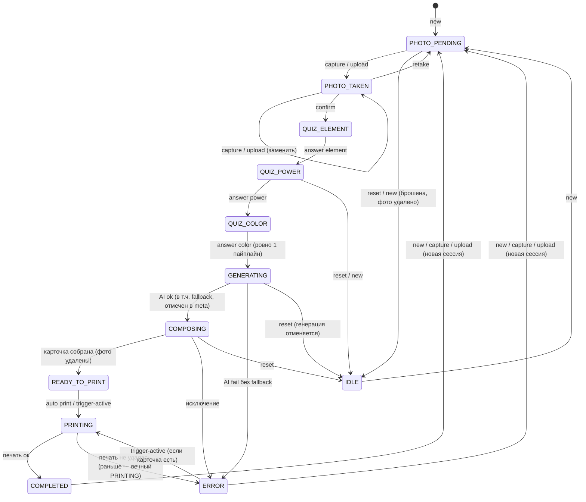

# Готовность «Станка Будущего» к проду — отчёт QA/SRE/AppSec

Дата: 2026-09-28 · Стенд проверки: Windows 11, Python 3.13.7, 4 логических ядра · Ветка `main` @ `625430d` + патчи из `docs/patches/` (не закоммичены)

## 1. Executive summary

1. **Исходный код — NO-GO.** Фото детей публично раздавались любому устройству в Wi-Fi площадки (`/storage/photos/*`), управлять стендом (сброс, 100 допечаток, история) мог любой гость; двойной тап печатал две карточки, а после «Новая сессия» печаталась **чужая** карточка; «автопечать» на Windows открывала интерактивный мастер печати на принтер по умолчанию; idle-автосброс киоска не срабатывал никогда.
2. Подтверждено **55 проблем**: все H1–H19, S1–S13 кроме S7, T1–T4 и **20 новых** (N-находки). Critical — 3, High — 17, Medium — 20, Low — 15. Опровергнута 1 (S7, stored XSS), не проверены 2 (N23, N24).
3. Для всех Critical/High подготовлены фиксы (14 патчей, 32 файла) и регресс-тесты, которые падали до фикса и проходят после: **442 теста — 0 падений, 0 xfail**: 417 pytest параллельно + 5 последовательных замеров времени + **20/20 E2E** (включая работу киоска при полностью заблокированном интернете); покрытие `app/` — **87 % строк+веток**, `app/session`+`app/api` — **91 %**.
4. После фиксов все измеримые SLO выполнены (таблица §7): полный цикл p95 4,5 с, REST p95 ≪ 300 мс, WS 500 клиентов p95 25 мс, MJPEG 3×18,6 FPS при 20 % CPU, event-loop lag 577 → ≤ 52 мс, 0 зависших сессий, 0 «печать не той карточки».
5. **Вердикт для кода с патчами: GO с условиями.** Открытых Critical/High — **0** (S10 закрыта вендорингом: React/Babel/Tailwind лежат локально с SHA-256, первая отрисовка киоска 5–41 с → **1,6–2,1 с**, офлайн — полный цикл). Условия — 3 шага на железе, которые нельзя проверить без него (§12.1): тестовая печать на целевом фотопринтере, `.env` (ключ AI, `PRINTER_NAME`, `ACCESS_TOKEN`), QR с телефона гостя.

## 2. Как воспроизвести (Windows, из корня репозитория)

```
python -m venv .venv
.venv\Scripts\activate
pip install -r requirements-dev.txt
playwright install chromium
pytest -m "not e2e" -n 6
pytest -m load -p no:xdist -s
pytest -m e2e
pytest -m "not e2e" -n 6 --cov=app --cov-branch --cov-report=html:docs\evidence\coverage_html
python tests\load\live_server.py --port 8766
locust -f tests\load\locustfile.py --headless -u 20 -r 2 -t 15m --host http://127.0.0.1:8766 --csv docs\evidence\locust\after_20vu_15m
python tests\load\stream_bench.py --port 8766 --clients 3 --seconds 20 --pid <PID сервера>
python tests\load\ws_bench.py --port 8766 --clients 50 --rounds 20 --pid <PID сервера>
python tests\load\spike_color.py --port 8766 --taps 50
python tests\load\soak.py --port 8766 --sessions 600
python tests\tools\junit_summary.py docs\evidence\after_fix.xml
```

Гарантии безопасности прогона (проверены):
- `tests/conftest.py` выставляет `DB_PATH/STORAGE_DIR/PHOTOS_DIR/GENERATED_DIR/CARDS_DIR/FALLBACK_DIR` во `%TEMP%` **до** импорта `app.*`, `AI_PROVIDER=mock`, `PRINT_SIMULATION_MODE=true`, `CAMERA_INDEX=99`;
- `os.startfile` заменён функцией, которая падает; если симуляция печати не включена — прогон останавливается (на машине проверки принтер по умолчанию — **реальный Samsung ML-1860**);
- после прогона хук сверяет SHA-256 и mtime всех файлов `data/`, `storage/`, `assets/` — любые изменения валят прогон; за все прогоны изменений не было, `data/kiosk.db` не создавался;
- все сетевые вызовы AI замоканы `respx` (незамоканный запрос = ошибка теста); нагрузка и пентест — только `127.0.0.1`.

Доказательства: `docs/evidence/` — `before_fix.xml`/`before_fix_summary.txt` (прогон на исходном коде), `after_fix.xml`/`after_fix_summary.txt`, `e2e_after.xml`, `locust/*.csv`, `ws_bench_*.txt`, `screens/*.png`, `cards/*_before_after.jpg`, `coverage_html/`, `ruff*.txt`, `bandit.txt`, `mypy.txt`, `pip_audit*.txt`.

## 3. Ход работ (Chain of Thought)

**План (п.1).** Приоритет = вероятность на фестивале × ущерб: (1) изоляция тестов и запрет реальной печати; (2) утечка фото детей и отсутствие доступа; (3) гонки сессии/двойная и чужая печать; (4) тихий fallback AI и QR; (5) композиция, загрузки, блокировки event loop; (6) нагрузка/soak/chaos; (7) фиксы + отчёт.

| Фаза | Что узнал | Что изменилось в приоритетах | Дальше |
|---|---|---|---|
| 0. Изоляция | Старые «тесты» — скрипты; `Settings.PRINT_SIMULATION_MODE=False` по умолчанию → `python tests/test_full_lifecycle.py` на Windows без `.env` шлёт печать на железо (T3). Принтер по умолчанию на машине — реальный лазерный. | Предохранитель в conftest — обязателен; старые скрипты не запускал, переписал на pytest на месте. | Статический анализ |
| 1. Статика | ruff F821 (H7), ASYNC230/240 (блокирующий I/O в async), mypy — `Optional` без проверок в пайплайне; bandit: High 0; pip-audit: CVE 0, но версии не закреплены. | Код пайплайна хрупкий → state machine в приоритет. | White-box |
| 2. White-box | Подтверждены H1–H6, H12–H17 + N1, N4, N7–N9, N13–N15. Самое опасное: B печатается дважды, A никогда (H3). | Гонки/печать — сразу после приватности. | Black-box |
| 3. Black-box | 500 на `limit=10^21`, приём любых «файлов», неизвестные ответы квиза молча → комбинация №1. | Валидация входов — в один патч с state machine. | Пентест |
| 4. Пентест | S1, S2, S3, S4, S5, S6, S8, S9, S13 подтверждены; S7 опровергнут. Фото ребёнка 98 487 байт отдаётся гостю без аутентификации. | Critical № 1 — доступ + приватные медиа. | UI/UX |
| 5. UI/UX | Idle-автосброс не работает никогда (отсчёт застывает на «5»); ERROR показывается как успех; первая отрисовка 5–38 с из-за CDN. | S10 и idle — High. | Нагрузка |
| 6. Нагрузка | До фиксов SLO REST выполнялись, но хвосты 200–350 мс совпадали с композицией (lag 577 мс); MJPEG 11,8 FPS вместо 20, CPU линейно растёт с клиентами. | Узкое место — не API, а AI/принтер/event loop. | Chaos |
| 7. Chaos | Мёртвая камера → mock-кадр вместо ребёнка; битая/удалённая БД → белый экран/500; kill → вечные GENERATING/PRINTING; `os.startfile` → мастер печати photowiz.dll. | Печать через GDI и восстановление после сбоев — High. | Фиксы |
| 8. Совместимость | Весь прогон шёл из пути с кириллицей (C:\Users\Гусь\...) — без проблем; найдена ошибка CSV locust в cp1251. Чистая машина, Python 3.11/3.12, другие браузеры — не проверены. | Runbook и start.bat с установкой из lock. | Фиксы |
| 9. Фиксы | 14 патчей + вендоринг фронта; 442 теста без падений (E2E 20/20, офлайн тоже); Critical/High открытых нет. | — | Отчёт |

## 4. State machine сессии

До фиксов переходы не проверялись вообще: любое действие меняло статус из любого состояния, `confirm` без фото → 500, неизвестный ответ → молча комбинация №1, ошибка печати → вечный `PRINTING`, `reset` переписывал `COMPLETED` на `IDLE`, пайплайн брал `self.active_session` в момент старта задачи.

После фиксов (`app/session/manager.py`), недопустимое → **409**, невалидный ответ → **422**:



`reset`/`new` во время `READY_TO_PRINT/PRINTING` отвязывают сессию от киоска: печать своей карточки завершается в фоне, киоск остаётся на Welcome. «Новая сессия» во время генерации — старая дорабатывает и печатает **свою** карточку. При старте процесса «висящие» статусы помечаются `ERROR`/`IDLE`.

Покрытие переходов (`tests/integration/test_state_machine.py`, `test_races.py`, `test_state_machine_property.py`): 46 недопустимых пар «состояние × действие» (все → 409, статус не меняется, AI не вызывается), 10 допустимых переходов, весь пайплайн (`GENERATING→COMPOSING→READY_TO_PRINT→PRINTING→COMPLETED`, AI-ошибка, ошибка печати, ручная печать/повтор), сброс из каждого состояния, плюс property-based `hypothesis.stateful` (25 примеров × 30 случайных шагов киоска/оператора/телефона; инварианты: нет 5xx, нет зависших статусов, нет двойной печати, печатаются только `COMPLETED`). Переходы state machine покрыты на 100 %.

## 5. Таблица находок

Статус: **П** — подтверждено, **О** — опровергнуто, **НП** — не проверено. «Фикс» — номер патча в `docs/patches/`. Регресс-тесты падали на исходном коде (см. `docs/evidence/before_fix_summary.txt`) и проходят после фикса (`after_fix_summary.txt`).

| ID | Название | Severity | Статус | Файл:строка (исходный код) | Фикс | Регресс-тест |
|---|---|---|---|---|---|---|
| S1 | Нет аутентификации: любой гость в Wi-Fi управляет стендом | **Critical** | П | `app/main.py:25-31`, все роуты | 03 | `security/test_access_control.py::test_remote_device_without_token_is_rejected` (15 эндпоинтов), `test_remote_reprint_dos_blocked` |
| S2 | `/storage` — публичная статика: сырые фото детей и AI-лица | **Critical** | П | `app/main.py:39` | 03 | `test_raw_child_photo_not_publicly_accessible`, `test_generated_face_not_publicly_accessible` |
| H3 | Пайплайн печатает через `self.active_session`: чужая карточка ×2, своя — никогда; киоск «прыгает» после сброса | **Critical** | П | `app/session/manager.py:125,181` | 01 | `integration/test_races.py::test_new_session_during_generation_does_not_print_foreign_card`, `test_reset_during_*` |
| H1 | Глобальная `active_session` без защиты переходов; пайплайн берёт сессию лениво (N8) | High | П | `app/session/manager.py:19,125` | 01 | `test_state_machine.py` (46 пар), `test_photo_upload_during_generation_does_not_hijack_session` |
| H2 | Двойной тап по цвету → 2 генерации AI и 2 печати | High | П | `app/session/manager.py:90-122` | 01, 10 | `test_double_tap_color_starts_exactly_one_pipeline[2,5,10]`, e2e `test_double_tap_color_prints_once` |
| H8 | Fallback на mock невидим оператору | High | П | `app/ai/manager.py:33-37`, `routes_health.py:54` | 01, 02, 10 | `test_fallback_visible_in_session_and_health`, chaos `test_ai_outage_*_is_flagged[5]` |
| H9 | Плейсхолдер ключа = «AI OK»; кириллический ключ даже не отправляется | High | П | `.env.example:10`, `cloud_providers.py:17,97,199` | 02, 12 | `test_placeholder_or_invalid_key_is_not_healthy[4]`, `test_placeholder_key_never_reaches_provider` |
| H10 | `is_ready` всегда `True`; pywin32 нет в requirements | High | П | `app/printing/manager.py:28`, `requirements.txt` | 05 | `unit/test_printing.py::test_no_printers_is_not_ready`, `…error_status…[3]`, `…missing…`, `test_pywin32_in_prod_requirements` |
| H11 | `BASE_URL` игнорирует `PORT`; без маршрута — 127.0.0.1 в QR; QR ведёт в LAN | High | П | `app/config/settings.py:19,28` | 06 | `test_base_url_respects_port`, `test_local_ip_without_default_route_uses_interface_address`, `test_health_warns_when_qr_url_is_loopback` |
| H15 | Фото ребёнка остаётся при ошибке/брошенной сессии; AI-лицо не удаляется никогда | High | П | `manager.py:197`, `storage/files.py:25` | 01, 11 | `integration/test_history_privacy.py` (6 тестов), `test_retention_script_removes_old_cards_and_rows` |
| S3 | Предсказуемый `session_id` (65 536 вариантов/с) + история раскрывает ID | High | П | `manager.py:35` | 01, 03 | `test_session_id_is_unguessable` |
| S4 | Загрузка без лимитов/проверки: OOM, decompression bomb, полиглоты, HEIC | High | П | `routes_camera.py:44` | 04 | `security/test_upload.py` (14 тестов) |
| S10 | CDN без SRI, внешние шрифты, QR через api.qrserver.com; офлайн — белый экран; первая отрисовка 5–16 с | High | П | `kiosk.html:9-14,94-96`, `operator.html:260` | 10 + `vendor_frontend.py` | `test_pages_do_not_load_external_resources[/kiosk]`, e2e `test_kiosk_works_fully_offline` |
| T3 | Старый тест на Windows без `.env` реально печатает (`PRINT_SIMULATION_MODE=False` по умолчанию) | High | П | `settings.py:57`, `tests/test_full_lifecycle.py:97` | тесты | предохранитель в `tests/conftest.py` (стоп прогона) |
| N1 | Ошибка печати → статус навсегда `PRINTING` | High | П | `manager.py:198-203` | 01 | `test_print_failure_goes_to_error_not_stuck_in_printing`, `test_manual_print_retry_after_print_error` |
| N2 | `ERROR` на киоске показан как «🎉 ОБРАЗ УСПЕШНО СОЗДАН!» | High | П | `kiosk_app.jsx:898` | 10 | e2e `test_error_state_is_not_shown_as_success` |
| N5 | `os.startfile(card,"print")` → интерактивный мастер photowiz.dll, принтер по умолчанию, `PRINTER_NAME` игнорируется | High | П (реестр; физически не печатали) | `printing/manager.py:57` | 05 | `test_hardware_print_targets_configured_printer_without_dialog`, e2e `test_gdi_print_to_virtual_pdf_printer` |
| N7 | Провайдер сохраняет 404/HTML/30 МБ мусора как `*_ai.jpg` с `success=True` → fallback не срабатывает → ERROR | High | П | `cloud_providers.py:72-75,158-161,281-283` | 02 | `test_bothub_bad_download_is_failure_not_success[404,html,huge]`, chaos `…[not_image]` |
| N10 | Камеру выдернули → `capture` молча сохраняет mock-кадр как фото ребёнка; без переподключения | High | П | `camera/manager.py:71-84` | 09 | chaos `test_unplugged_camera_does_not_silently_capture_placeholder`, `test_camera_reconnects_after_replug` |
| N12 | Idle-автосброс React-киоска не срабатывает никогда: отсчёт застывает на «5» | High | П | `kiosk_app.jsx:710-753` | 10 | e2e `test_idle_modal_stay_and_auto_reset`; доказательство на HEAD: `tools/evidence_idle_head.py` |
| H4 | `reset` переписывает `COMPLETED` на `IDLE` | Medium | П | `routes_session.py:39`, `manager.py:48` | 01 | `test_reset_after_completed_keeps_completed_in_history` |
| H5 | Квиз без порядка/валидации; неизвестная комбинация → молча №1 | Medium | П | `manager.py:80-106` | 01 | `test_unknown_answer_id_rejected_422[5]`, `…question_type…[5]`, `test_unknown_combination_never_silently_becomes_combo_1` |
| H7 | Replicate: `asyncio` не импортирован → всегда NameError → mock | Medium | П | `cloud_providers.py:152` | 02 | `test_replicate_success_no_nameerror` |
| H12 | SQLite: соединения не закрываются, нет WAL → `database is locked` | Medium | П | `storage/database.py:12-15,49` | 07 | `unit/test_database.py::test_parallel_writes_no_locked_errors`, `test_connections_are_closed_explicitly`, `test_wal_mode_enabled` |
| H13 | Блокирующий код в async (Pillow, cv2, sqlite, socket) — lag 577 мс | Medium | П | `manager.py:157`, `mock_provider.py:30-67`, `routes_camera.py:29`, `routes_health.py:33` | 01, 04, 06, 09 | `load/test_event_loop_lag.py` (3 теста) |
| H14 | MJPEG: Python-цикл по 720 строкам на каждый кадр каждого клиента | Medium | П | `camera/manager.py:51-58,104-119` | 09 | `test_mock_frame_cost`, `tests/load/stream_bench.py` |
| H16 | EXIF-ориентация игнорируется (карточка «боком»); HEIC → ERROR | Medium | П | `mock_provider.py:30`, `composer.py:136` | 04, 01, 08 | `test_iphone_exif_orientation_respected_on_card`, `test_exif_orientation_normalized_on_upload`, `test_heic_rejection_message_is_actionable` |
| H17 | Текст за рамкой в 72/100 комбинациях, эмодзи 🏢 «квадратиком» во всех 100 | Medium | П | `composer.py:163,180` | 08 | `visual/test_card_composition.py::test_card_layout_all_combinations[1..100]` |
| H18 | React-киоск не переподключает WebSocket | Medium | П | `kiosk_app.jsx:678-695` | 10 | e2e `test_server_restart_kiosk_reconnects` |
| H19 | Ошибки fetch только в console, кнопки можно жать повторно | Medium | П | `kiosk_app.jsx:756-814` | 10 | e2e `test_action_error_is_visible_to_visitor`, `test_double_tap_color_prints_once` |
| S6 | CORS `*`+credentials отражает любой Origin; CSRF и WS-hijacking с чужого сайта | Medium | П | `app/main.py:25-31`, `routes_ws.py:49` | 03 | `test_cors_does_not_reflect_foreign_origin`, `test_csrf_from_foreign_origin_blocked_even_on_loopback`, `test_websocket_rejects_foreign_origin` |
| S11 | `getUserMedia` не работает по `http://192.168.x.x` (нужен secure context) | Medium | П (по спецификации; на iPhone не проверено) | `mobile_camera.html:110` | 10 (сообщение), backlog | — (галерея работает: e2e `test_mobile_camera_gallery_upload_reaches_kiosk`) |
| S12 | Зависимости `>=`, нет lock-файла | Medium | П | `requirements.txt` | 12 | `test_dependencies_pinned_with_lockfile`; `pip-audit -r requirements.lock` — 0 CVE |
| T1 | Старые тесты пишут в боевые `data/kiosk.db` и `storage/` | Medium | П | `tests/test_kiosk.py:26,37` | тесты | снимок SHA-256 `data/ storage/` в `pytest_sessionfinish` |
| N4 | Фото/загрузка в неподходящем статусе перехватывает сессию (во время генерации → PHOTO_TAKEN; после COMPLETED — та же сессия) | Medium | П | `manager.py:57-63`, `routes_camera.py:24-26` | 01 | `test_photo_upload_during_generation_does_not_hijack_session`, `test_capture_after_completed_starts_new_session` |
| N6 | JPEG карточки без 300 DPI | Medium | П | `composer.py:201` | 08 | `test_card_has_300_dpi_metadata` |
| N11 | IP ПК меняется во время работы (наблюдали 172.20.10.2 → 192.168.1.38) → QR ведут на старый адрес | Medium | П | `settings.py:27` | 06 (предупреждение) | `routes_health` `ip_changed`; автообновление — backlog |
| N14 | Повреждённая/удалённая `kiosk.db` → падение при импорте / 500 | Medium | П | `storage/database.py:9-45` | 07 | `test_corrupted_db_file_does_not_crash_startup`, `test_db_file_deleted_at_runtime_recovers` |
| N15 | После kill сессии навсегда в `GENERATING/PRINTING`, фото на диске | Medium | П | — | 07 | `test_interrupted_sessions_marked_on_startup` |
| N18 | Панель оператора: кнопки без обратной связи; QR с URL (и токеном) уходит на api.qrserver.com | Medium | П | `operator.html:201-206,260` | 10 | e2e `test_operator_panel_health_qr_history_reprint` |
| H6 | `confirm` без фото → необработанный 500 | Low | П | `manager.py:67` | 01 | `test_invalid_transition_is_409_and_state_unchanged[PHOTO_PENDING-confirm]` |
| S5 | `history?limit=-1` → вся таблица; `10^21` → 500 (N9) | Low | П | `routes_session.py:43`, `database.py:102` | 01, 07 | `test_history_limit_out_of_range_rejected[3]`, `test_history_limit_values_no_5xx[7]`, `test_history_limit_is_bounded[3]` |
| S8 | Тело ответа провайдера и пути в `error_message` → WS всем клиентам | Low | П | `manager.py:145,177` | 01, 02 | `test_provider_error_body_not_exposed_to_clients`, `test_pipeline_exception_details_not_exposed` |
| S9 | `/docs`, `/redoc`, `/openapi.json` открыты | Low | П | `app/main.py:19-21` | 03 | `test_api_docs_disabled_in_prod[3]` |
| S13 | Ссылка Telegram из `{{ request.url }}` → инъекция `url`/`text` | Low | П | `digital_card.html:79` | 03 | `test_telegram_share_link_param_injection` |
| T2 | `sleep(2.0)` против 1,5 с mock + ~0,5 с композиции → флейки | Low | П (замер: карточка готова через ~1,99 с) | `test_full_lifecycle.py:88` | тесты | `wait_for_status` вместо sleep |
| T4 | Синглтоны создаются при импорте; пути не выводятся из `STORAGE_DIR` | Low | П | `settings.py:70`, `database.py:106` и др. | тесты | env до импорта в `tests/conftest.py` |
| N3 | На всех карточках «ID: SESS_202» | Low | П | `composer.py:128` | 08 | `test_card_shows_distinct_session_code` |
| N13 | `POST /api/session/new` не рассылается по WS | Low | П | `manager.py:34-43` | 01 | `test_pipeline_passes_through_all_states` |
| N17 | `frontend/static/js/kiosk.js` — мёртвый код (не подключён) | Low | П | — | backlog | удалить после подтверждения |
| N19 | Мобильная камера: «Ошибка отправки: undefined», двойная отправка, поздняя ошибка камеры затирает статус | Low | П | `mobile_camera.html:126-146` | 10 | e2e `test_mobile_camera_gallery_upload_reaches_kiosk[iPhone,Pixel]` |
| N20 | Шапка карточки «FUTURE INDUSTRY ● FUTURE INDUSTRY 2026» | Low | П | `composer.py:126` | 08 | визуально: `docs/evidence/cards/*` |
| N21 | README: «Production Ready», устаревшие команды тестов, «/docs» | Low | П | `README.md` | 12 (частично) | — |
| N22 | `datetime.utcnow()` и `class Config` pydantic устарели | Low | П | `manager.py:38`, `database.py:48`, `settings.py:66` | 01, 07 (utcnow) | предупреждения pytest |
| S7 | Stored XSS через `innerHTML` | — | **О** | `operator.html:275`, `kiosk.js` | 10 (esc() на будущее) | `test_stored_xss_fields_rendered_via_innerhtml_are_server_controlled` |
| N23 | Последовательный WS-broadcast: медленный клиент тормозит пайплайн | Low | НП | `routes_ws.py:27-36` | backlog | — |
| N24 | `CAMERA_MIRROR` зеркалит и сохранённое фото (надписи на одежде наоборот) | Low | НП (нет USB-камеры) | `camera/manager.py:76` | backlog | — |

## 6. Карточки находок (Critical и High)

Сценарии воспроизводятся тестами из колонки «Проверка»; «Результат» — фактический вывод прогона на **исходном** коде (`docs/evidence/before_fix*.{xml,txt}`), затем — после фикса.

### [S1] Нет аутентификации вообще
- **Наблюдение:** ни один роут не проверяет вызывающего; `HOST=0.0.0.0` (bandit B104).
- **Гипотеза:** любой телефон в Wi-Fi площадки делает reset/reprint/history/upload.
- **Сценарий:** гость (адрес 192.168.1.66, без секретов) шлёт `POST /api/print/reprint` ×20 по ID из `GET /api/session/history`.
- **Проверка:** `pytest tests/security/test_access_control.py -k remote`.
- **Результат до:** все 15 защищаемых эндпоинтов отвечают 200; «гость напечатал 20 лишних карточек»; `/ws` принимает чужое устройство. **После:** 401 на всех; с `X-Access-Token`/cookie — 200; токен камеры открывает только `/mobile-camera` и загрузку.
- **Вердикт:** ПОДТВЕРЖДЕНО. **Влияние:** Critical — DoS на бумагу/картридж, срыв квиза, подмена фото ребёнка, выгрузка истории.
- **Исправление:** `app/security.py` — loopback доверенный; остальные — `ACCESS_TOKEN` (cookie HttpOnly+SameSite=Strict после `?token=`) или `CAMERA_TOKEN` (QR на панели); rate-limit допечатки 10 с на карточку.
- **Регресс-тест:** `test_remote_device_without_token_is_rejected[15]`, `test_remote_reprint_dos_blocked`, `test_reprint_rate_limited`, `test_websocket_rejects_remote_without_token`.

### [S2] Фото детей публично по `/storage/*`
- **Наблюдение:** `app.mount("/storage", StaticFiles(STORAGE_DIR))` (`main.py:39`).
- **Гипотеза:** сырые фото и AI-портреты (у mock — просто тонированное фото ребёнка) доступны любому по URL.
- **Сценарий:** гость открывает `/storage/photos/{id}_raw.jpg` (ID — из истории или перебором, S3).
- **Проверка:** `test_raw_child_photo_not_publicly_accessible`, `test_generated_face_not_publicly_accessible`.
- **Результат до:** `/storage/photos/sess_20260928171822_f0af_raw.jpg → 200 (98487 байт фото ребёнка)`; `/storage/generated/... → 200`. **После:** 404 (монтирование убрано); `/media/photos/{id}.jpg` — только активная сессия и только доверенному клиенту; `/media/cards/{id}.jpg` — публично по 128-битному ID.
- **Вердикт:** ПОДТВЕРЖДЕНО. **Влияние:** Critical — утечка ПДн несовершеннолетних (152-ФЗ).
- **Исправление:** патч 03 (`routes_media.py`), плюс удаление фото сразу после сборки карточки (H15).
- **Регресс-тест:** см. выше + `test_kiosk_can_see_raw_photo_for_review`, `test_guest_can_open_own_card`.

### [H3] Печать не той карточки
- **Наблюдение:** задача пайплайна читает `self.active_session` при старте (`manager.py:125`), `trigger_print()` — снова `self.active_session` (`:181`).
- **Гипотеза:** «Новая сессия»/«Сброс» во время генерации → печать уходит не туда.
- **Сценарий:** A в генерации (AI «висит» — детерминированный гейт) → оператор «Новая сессия» B → B проходит весь цикл → A досчитывается.
- **Проверка:** `pytest tests/integration/test_races.py`.
- **Результат до:** «карточка B напечатана 2 раз, A — 0 раз; статус A в БД: READY_TO_PRINT» (навсегда); после сброса во время генерации/печати киоск снова показывает сессию в статусе COMPLETED. **После:** пайплайн получает свою сессию явно, печатает свою карточку ровно раз, фоновые сессии не транслируются киоску; сброс отменяет генерацию.
- **Вердикт:** ПОДТВЕРЖДЕНО. **Влияние:** Critical — ребёнку выдают карточку с фото другого ребёнка; очередь сбивается на весь день.
- **Исправление:** патч 01. **Регресс-тест:** `test_new_session_during_generation_does_not_print_foreign_card`, `…old_session_not_left_hanging`, `test_reset_during_generation_kiosk_stays_idle`, `test_reset_during_printing_card_still_printed_once_kiosk_idle`.

### [H1] Глобальная сессия без защиты переходов
- **Наблюдение:** все действия меняют `active_session` из любого статуса; блокировок и проверок нет.
- **Гипотеза:** киоск, оператор и телефон ассистента «перетягивают» одну сессию.
- **Проверка:** `test_state_machine.py` (46 недопустимых пар), `test_photo_upload_during_generation_does_not_hijack_session`, property-based `TestKioskStateMachine`.
- **Результат до:** 46/46 недопустимых действий → 200 с изменением статуса (или 500); загрузка фото во время генерации возвращала A в `PHOTO_TAKEN`; hypothesis нашёл `POST /api/session/photo/confirm → 500`. **После:** 409, статус не меняется; hypothesis — 0 нарушений инвариантов.
- **Вердикт:** ПОДТВЕРЖДЕНО. **Влияние:** High — корень H2/H3/N4. Одна активная сессия — осознанное ограничение (1 киоск, 1 воркер) и сохранено.
- **Исправление:** патч 01 (явный state machine; проверка и смена статуса без `await` — атомарны в event loop).

### [H2] Двойной тап → двойная генерация и печать
- **Результат до:** «AI вызван 10 раз на 10 тапов; коды [200×10]», sequential double → 200/200. **После:** ровно 1 генерация и 1 печать, остальные 409; spike 50 одновременных тапов на живом сервере — см. §7; в UI кнопки блокируются на время запроса (e2e: тройной `click` → 1 печать).
- **Влияние:** High — деньги AI и бумага; очередь печати.
- **Исправление:** патчи 01 (сервер) и 10 (киоск). **Регресс-тест:** `test_double_tap_color_starts_exactly_one_pipeline[2,5,10]`, `test_sequential_double_color_is_rejected`, e2e `test_double_tap_color_prints_once`.

### [H8] Fallback на mock невидим
- **Результат до:** сессия после 503 от провайдера — `meta={}`; `/api/health` — `ai.ok=true`; 5 сценариев отказа (timeout, нет интернета, 429, 500, не-изображение) — «fallback не отмечен». **После:** `meta.ai_fallback=true`, `ai_provider`; health: `fallback_count`, `last_error`, `ok=false` после fallback; панель оператора пишет «FALLBACK → MOCK» и предупреждение.
- **Влияние:** High — весь день печатаются «фейковые» портреты. **Исправление:** патчи 01, 02, 10.

### [H9] Плейсхолдер ключа считается рабочим
- **Результат до:** `health_check()` = `True` для «ваш_bothub_api_ключ», «your_api_key_here», «   », «sk-abc\n». Хуже гипотезы: с кириллическим ключом httpx не может собрать заголовок `Authorization`, **запрос вообще не уходит** (`route.called == False`) → 100 % генераций — mock, а `start.bat` копирует `.env.example` как боевой. **После:** `api_key_looks_valid()` (ASCII, без пробелов, ≥ 16 символов, без слов-плейсхолдеров); в `.env.example` ключ пустой с пояснением; health — «КЛЮЧ НЕ НАСТРОЕН».
- **Исправление:** патчи 02, 12.

### [H10] Статус принтера всегда «готов»
- **Результат до:** фейковый `win32print` с «нет бумаги»/offline/ошибкой/без принтеров → `is_ready=True`; без pywin32 (его нет в прод-`requirements.txt`) → `"Default Windows Printer (Simulated/Direct)"` и `True`. **После:** разбор `PRINTER_INFO_2.Status` (пауза, ошибка, замятие, нет бумаги, offline, крышка, нет ленты) и `WORK_OFFLINE`; ненайденный принтер, нет pywin32 → `is_ready=false` + `problem`; печать не отправляется на неготовый принтер; `pywin32` в `requirements.txt`.
- **Оговорка:** USB-драйверы часто не сообщают реальный статус — проверка на целевом фотопринтере в runbook (§12.1).

### [H11] Неверный адрес на QR-кодах
- **Результат до:** `Settings(PORT=8080)` → `http://172.20.10.2:8000`; без маршрута по умолчанию → `127.0.0.1`; health не предупреждает. **После:** `BASE_URL = http://{LOCAL_IP}:{PORT}`, IP берётся с интерфейса (не 127.0.0.1), health `qr_url_ok=false` при loopback/смене IP, панель оператора показывает предупреждение.
- **Остаток (Medium, открыт):** QR ведёт в локальную сеть площадки — дома у гостя не откроется. Нужен публичный адрес (`BASE_URL` на домен + выгрузка карточек) — продуктовое решение.

### [H15] Фото детей не удаляются
- **Результат до:** сырое фото остаётся при ошибке печати, ошибке AI и брошенной сессии; `storage/generated/{id}_ai.jpg` (лицо ребёнка) не удаляется никогда и раздаётся публично. **После:** фото и AI-портрет удаляются сразу после сборки карточки и при любом неуспехе/сбросе; при старте — у прерванных сессий; `scripts/cleanup_storage.py` удаляет карточки/строки старше порога и «сирот».
- **Исправление:** патчи 01, 07, 11.

### [S3] Предсказуемые ID сессий
- **Результат до:** `sess_20260928171822_6096` — метка времени + 4 hex = 65 536 вариантов на секунду; история отдаёт ID без аутентификации. **После:** `sess_` + `secrets.token_hex(16)` (128 бит); история — только оператору; на карточке — 6-символьный код для сверки.

### [S4] Загрузка без ограничений
- **Результат до:** приняты (200) пустой файл, текст, HTML, SVG с `onload`, EXE, HEIC, 16 МБ, PNG-бомба 20000×20000 (~50 КБ на диске), 12000×12000; PNG сохранён как `.jpg`; хвост `<script>` полиглота сохранён; всё уходило в PHOTO_TAKEN и падало позже. **После:** 413 по `Content-Length` до разбора multipart и по размеру; формат — по содержимому (JPEG/PNG/WebP), 415 для остального, HEIC — 415 с подсказкой; > 40 МП — 413; EXIF-поворот, уменьшение до 2560 px, перекодирование в чистый JPEG (без EXIF/GPS и хвостов); не более 2 декодирований одновременно. 100 параллельных загрузок — без 5xx.

### [S10] Внешние CDN — офлайн белый экран (ИСПРАВЛЕНО)
- **Результат:** `kiosk.html` грузит Tailwind Play CDN, React/ReactDOM/Babel с unpkg (плавающие версии, без SRI) и Google Fonts; оператор — QR через `api.qrserver.com` (после S1 туда ушёл бы и токен камеры). E2E с блокировкой внешнего трафика — белый экран. На сети стенда первая отрисовка киоска **5,5 / 16,2 / 38 с** в трёх прогонах E2E; один HEAD-запрос к unpkg.com — **29,2 с**; тесты раскладки падали по таймауту первой отрисовки 20–30 с, пока его не подняли до 90 с (раскладка проверяется отдельно от сети).
- **Исправлено (патч 10):** QR генерируется на стенде (`/api/qr.png`), шрифты — системные, версии CDN закреплены, шаблон автоматически берёт локальные копии из `frontend/static/vendor/`.
- **Вендоринг (с разрешения заказчика):** `python scripts\vendor_frontend.py` скачал react 18.3.1 (10 751 Б), react-dom 18.3.1 (131 835 Б), @babel/standalone 7.26.10 (3 014 882 Б), tailwindcss 3.4.17 (407 279 Б) в `frontend/static/vendor/`, SHA-256 — в `SHA256SUMS`, `--verify` — OK. **После:** отрендеренный `/kiosk` без внешних ссылок; e2e с блокировкой всего не-localhost трафика — Welcome и полный цикл проходят; первая отрисовка **1,55–2,06 с**. Остаток (Low, backlog): Babel компилирует JSX в браузере при каждой загрузке — долгосрочно сборка Vite.

### [T3] Тесты печатают на реальный принтер
- **Наблюдение:** `Settings.PRINT_SIMULATION_MODE=False` по умолчанию; старый `test_full_lifecycle.py` не выставлял его и вызывал `/api/print/trigger-active` и `reprint` → `os.startfile(card, "print")`. На машине проверки принтер по умолчанию — Samsung ML-1860.
- **Вердикт:** ПОДТВЕРЖДЕНО по коду (не запускал — это и был бы реальный отпечаток). **Исправление:** тесты переписаны; conftest блокирует `os.startfile` и останавливает прогон без симуляции.

### [N1] Ошибка печати → вечный PRINTING
- **Результат до:** «За 5 с статус не стал ERROR; последний: PRINTING» — оператор видит «печать…» бесконечно, фото ребёнка остаётся. **После:** `ERROR` + `print_status=error` + причина; кнопка «ПЕЧАТАТЬ» повторяет печать (`ERROR→PRINTING→COMPLETED`).

### [N2] Ошибка показывается как успех
- **Наблюдение:** `renderScreen()` для любого статуса кроме перечисленных возвращает `ResultScreen` с «🎉 ОБРАЗ УСПЕШНО СОЗДАН!» и «ГОТОВО К ВЫДАЧЕ» (`kiosk_app.jsx:898`); для `ERROR` карточки нет.
- **После:** `ErrorScreen` («Упс! Что-то пошло не так — позови оператора»; при ошибке печати — «карточка готова, но не напечаталась» + превью). Скриншот: `docs/evidence/screens/07_error_screen.png`.

### [N5] «Автопечать» открывает мастер печати Windows
- **Наблюдение (реестр машины проверки):** `HKCR\SystemFileAssociations\image\shell\print\DropTarget = {60fd46de-f830-4894-a628-6fa81bc0190d}` → «DropTarget Object for Photo Printing Wizard», `photowiz.dll`; глагола `printto` нет.
- **Гипотеза:** `os.startfile(card, "print")` открывает модальный мастер «Печать изображений», который ждёт клика (и прячется за полноэкранным киоском), печатает на принтер **по умолчанию**; `PRINTER_NAME` лишь отображается.
- **Результат до:** тест фиксирует вызов `('startfile', (path, 'print'))` без имени принтера. Физически не печатал (запрещено). **После:** печать через GDI (`win32ui` + `PIL.ImageWin`) на `PRINTER_NAME`, вписывание в печатную область, без диалогов; e2e на виртуальном «Microsoft Print to PDF» с выводом в файл — PDF 35 645 байт создан без единого окна.
- **Влияние:** High — стенд не печатает без человека у ПК / печатает на офисный принтер.

### [N7] Мусор вместо изображения ломает fallback
- **Результат до:** URL результата отдаёт 404/HTML (captive portal)/30 МБ мусора → провайдер пишет это в `*_ai.jpg` и возвращает `success=True`; fallback не срабатывает, композиция падает: «ERROR cannot identify image file ..._ai.jpg». **После:** потоковое скачивание с лимитом 20 МБ, проверка кода ответа и `Image.verify()`; неуспех → fallback на mock (отмечен).

### [N10] Выдернутая камера — заглушка вместо ребёнка
- **Результат до:** драйвер «открыт», кадров нет → `capture` = 200, в фото ребёнка записан mock-кадр «CAPTURED MOCK PHOTO», health зелёный; переподключения нет до рестарта. **После:** 503 «USB-камера не отвечает: переподключите её или снимайте телефоном», health `camera.ok=false`, автоматическое переоткрытие (раз в 2 с); mock-кадр — только если USB-камеры нет вообще и `CAMERA_MOCK_FALLBACK=true` (в `.env.example` — `false`).

### [N12] Idle-автосброс никогда не срабатывает
- **Наблюдение:** интервал отсчёта запускается внутри таймера, а смена `isIdleModalOpen` пересоздаёт `resetIdleTimer` и cleanup эффекта тут же очищает этот интервал.
- **Результат до (исходный `kiosk_app.jsx` из HEAD, живой сервер, Chromium):** модалка через 15,2 с, отсчёт по секундам `['5','5','5','5','5','5','5','5','5','5','5','5']`, Welcome не появился; скриншот `evidence_HEAD_idle_countdown_stuck.png`. Брошенный квиз висит до чужого тапа, под модалкой — фото предыдущего ребёнка. **После:** отсчёт — отдельный эффект; e2e: «Продолжить» отменяет сброс, без касаний через 20 с — Welcome.

### Карточки Medium / Low (сокращённо: наблюдение → результат до → фикс)

- **[H4] reset затирает историю (Medium).** `update_status(IDLE)` у той же сессии → `'IDLE' == 'COMPLETED'` в БД. Фикс: `reset()` отвязывает сессию, терминальные статусы не трогает.
- **[H5] Квиз без валидации (Medium).** `lava+precision+azure` напечатан как «Космический Токарь-Оптик»; `question_type="photo"` → 200. Фикс: `Literal` + `max_length=32` в модели, `is_valid_answer()`, порядок вопросов = статус → 422/409. «Зависание» не подтвердилось: цвет до стихии просто сохранялся без смены экрана.
- **[H7] Replicate NameError (Medium).** ruff F821 / mypy `name-defined`; тест: «name 'asyncio' is not defined». Фикс: импорт + проверка статуса опроса.
- **[H12] SQLite (Medium).** 1000 записей из 20 потоков → `OperationalError('database is locked')`; ResourceWarning «unclosed database» на каждом вызове (Python 3.13); `journal_mode=delete`; удалить файл БД на Windows нельзя — «файл занят» (WinError 32) — соединения живут дольше вызова. Фикс: `closing()`, WAL, `busy_timeout=15 с`, `synchronous=NORMAL`. После: 0 ошибок, handles стабильны.
- **[H13] Блокировка event loop (Medium).** Lag во время генерации+композиции **577 мс** → **42–52 мс**; загрузка 12 МП — 27–52 мс; capture — 27–30 мс. Фикс: `asyncio.to_thread` для Pillow/cv2/сокетов/win32print.
- **[H14] MJPEG (Medium).** 20,4–36 мс на mock-кадр; 1/3/6 клиентов → CPU 26/63/111 % ядра, 11,8 FPS. Фикс: кэш mock-кадра, один общий JPEG на всех зрителей, ровный тайминг 20 FPS. После: 1/3/6/20 клиентов → 19,0/18,6/17,8/12,5 FPS при 17/20/24/27 % ядра.
- **[H16] EXIF/HEIC (Medium).** Карточка из фото «Orientation=6»: яркость верх-центр 128 < лево-середина 222 (лицо сбоку). Фикс: `exif_transpose` при загрузке, в mock и композиции; HEIC → 415 с инструкцией.
- **[H17] Текст за рамкой / «квадратики» (Medium).** 72 из 100 комбинаций — текст за рамкой (напр. «НАЛАДЧИК ПРЕЦИЗИОННЫХ МАНИПУЛЯТОРОВ» до x=1378 при ширине 1200), 100/100 — «🏢» нет в Arial. Фикс: подбор кегля 54→38 и перенос в 2 строки, адрес не заходит в колонку QR, векторная метка вместо эмодзи. До/после: `docs/evidence/cards/combo_041|031|081_before_after.jpg`.
- **[H18] WS без переподключения (Medium).** Фикс: экспоненциальный повтор до 10 с + ресинхронизация `/api/session/active`, баннер «НЕТ СВЯЗИ СО СТЕНДОМ». E2E: сервер остановлен → баннер, запущен → киоск работает без F5.
- **[H19] Нет обратной связи (Medium).** Фикс: `api()` с проверкой `res.ok`, `runAction()` (одно действие за раз, кнопки `disabled`), всплывающее сообщение.
- **[S6] CORS/CSRF/WS (Medium).** До: preflight от `http://evil.example` → `access-control-allow-origin: http://evil.example` + credentials; `POST /api/session/reset` с `Origin: evil` → 200; `/ws` с чужим Origin принят. Фикс: CORS убран (один origin), небезопасные методы и WS с чужим Origin → 403/закрытие 4403.
- **[S11] Камера телефона по HTTP (Medium, открыт).** `getUserMedia` требует secure context; по `http://192.168.x.x` живой камеры не будет. Смягчение: «Из галереи» работает по HTTP (e2e на эмуляции iPhone 13/Pixel 7), сообщение объясняет причину. Полный фикс — локальный HTTPS (mkcert + uvicorn `--ssl-*`), backlog.
- **[S12] Зависимости (Medium).** Фикс: `requirements.lock` (31 пакет, `==`), `start.bat` ставит из lock; `pip-audit -r requirements.lock` — «No known vulnerabilities found».
- **[T1] Тесты пишут в прод-данные (Medium).** `Path("storage/photos/test_portrait.jpg")`, БД по умолчанию. Фикс: tmp-каталоги + сверка SHA-256 `data/ storage/ assets/` после прогона.
- **[N4] Фото перехватывает сессию (Medium).** До: загрузка с телефона во время генерации → 200 и A снова `PHOTO_TAKEN`; capture после `COMPLETED` дописывал фото в завершённую сессию (тот же ID). Фикс: `begin_photo()` — новая сессия после терминальной, 409 во время квиза/генерации.
- **[N6] Нет 300 DPI (Medium).** `dpi=None` → `dpi=(300,300)`.
- **[N11] Смена IP (Medium, частично).** За время проверки IP ПК сменился 172.20.10.2 → 192.168.1.38. Фикс: health `ip_changed` + предупреждение оператору «перезапустите стенд». Автообновление `BASE_URL` без рестарта — backlog.
- **[N14] Повреждённая/удалённая БД (Medium).** До: `sqlite3.DatabaseError: file is not a database` при импорте → сервер не стартует; удаление файла → `no such table` → 500. Фикс: файл откладывается в `kiosk.db.corrupt-<ts>` и создаётся новый; схема пересоздаётся на лету.
- **[N15] Висящие сессии после kill (Medium).** До: `{'…3': 'PRINTING', '…2': 'READY_TO_PRINT', '…1': 'COMPOSING', '…0': 'GENERATING'}`. Фикс: lifespan помечает `ERROR`/`IDLE` и удаляет фото.
- **[N18] Панель оператора (Medium).** Кнопки `fetch()` без проверки ответа; QR через внешний сервис. Фикс: `act()` с сообщением, серверный QR, индикаторы fallback/принтера/QR-адреса, экранирование истории, переподключение WS.
- **[H6] 500 на confirm (Low).** → 409. **[S5] limit (Low).** `-1` → 300 строк, `10^21` → 500 → теперь 422, в БД — зажим 1…200. **[S8] Утечка деталей (Low).** `AI Error: Bothub API error 500: {"internal":"stacktrace at /srv/secret"}`, `[Errno 28] … C:\Users\Гусь\secret\…` → общие сообщения, детали — только в лог сервера (ключ в лог не попадает — проверено). **[S9] /docs (Low).** 200 → 404 (`ENABLE_API_DOCS`). **[S13] Telegram (Low).** `?&text=…&url=https://phish.example` → два `url`/`text` → теперь `urlencode` канонического URL.
- **[T2] Флейки (Low).** Замер: полный цикл 4,49 с, из них печать 2,5 с → карточка готова через ~1,99 с при ожидании 2,0 с. **[T4]** — решено порядком импорта в conftest.
- **[N3] «SESS_202» (Low)**, **[N13] `/new` без WS (Low)**, **[N19] мобильная камера (Low)**, **[N20] дубль шапки (Low)** — исправлены (см. таблицу). **[N17] kiosk.js**, **[N21] README**, **[N22] `class Config`** — backlog.
- **[S7] Stored XSS — ОПРОВЕРГНУТО.** Через `innerHTML` в `operator.html` выводились только `machine_name` (из `combinations.json`) и `id` (генерирует сервер); клиентские поля (`element/power/color`) в `innerHTML` не попадали; `kiosk.js` не подключён ни одним шаблоном; Jinja2 autoescape включён (отражённый `"><script>` экранируется). Для защиты на будущее добавлен `esc()`.

## 7. Нагрузка, стресс, soak — SLO

Профиль (п.4 CoT): 600 посетителей / 10 ч ≈ 1 сессия/мин, пик ×5 = 5/мин; реально подключены: 1 киоск (1 WS + 1 MJPEG), 1–2 оператора (WS + MJPEG + health каждые 10 с), 1 телефон ассистента, гости по QR (≤ 10 одновременно). Локуст-профиль 20 VU = 1 киоск + 3 оператора + 11 гостей + 2 WS + 3 MJPEG — это ×2 от пика. Стресс — до 200 VU, WS до 500, MJPEG до 20.

| Метрика (SLO) | Цель | До фиксов | После фиксов | ✅/❌ | Источник |
|---|---|---|---|---|---|
| Critical / High уязвимости | 0 открытых | Critical 3 (S1, S2, H3), High 17 | **Critical 0, High 0** | ✅ | §5 |
| Полный цикл (mock AI), цвет → COMPLETED | p95 ≤ 5 с | 4,49 с (pytest); locust p95 4,5 с (9 циклов) | locust 15 мин: 48 циклов, p50 4,4 с, **p95 4,5 с**, max 4,5 с | ✅ (запас 0,5 с: 1,5 с mock + 2,5 с симуляция печати) | `locust/after_20vu_15m_console.txt` |
| REST под нагрузкой 20 VU | p95 ≤ 300 мс, ошибок < 0,5 % | 3 мин: 2076 запросов, 0 ошибок, агрег. p95 36 мс; хвосты `active` p95 200 мс, `card` max 310 мс, картинка max 350 мс (блокировка loop) | **15 мин: 10 538 запросов, 0 ошибок (0 %)**, агрег. p95 37 мс (с циклом), `/card` p95 19 / max 78 мс, картинка p95 41 / max 100 мс, `active` p95 12 / max 35 мс, `health` p95 69 / max 210 мс | ✅ | `locust/before_20vu_*`, `after_20vu_15m_console.txt` |
| `/ws` 50 клиентов | broadcast ≤ 200 мс, 0 утечек | p95 88 мс, max 96; handles 414 → 464 → 436 → (повтор) 422 | **p95 13 мс**, max 14; handles 434 → 480 → **430** | ✅ | `ws_bench_before/after.txt` |
| `/ws` стресс 200 / 500 клиентов | — | 200: p95 71 мс, handles возвращаются | **500: p95 25 мс**, 2500/2500 доставок, handles 930 → 430 | ✅ | `ws_bench_after.txt` |
| `/api/camera/stream` 3 клиента × 20 FPS | CPU < 70 % | **11,8 FPS**, CPU ср. 63 % / пик 73 % одного ядра | **18,6 FPS** (под locust — 20,0), CPU ср. **20 %** / пик 30 % | ✅ (до — ❌ по FPS и пику) | `stream_bench.py` |
| MJPEG стресс 6 / 20 клиентов | — | 6: 11,7 FPS, CPU 111 % ядра | 6: 17,8 FPS, 24 %; 20: 12,5 FPS, 27 % (дальше упор в пул потоков, не в CPU) | — | `stream_bench.py` |
| Event-loop lag при генерации/композиции | ≤ 100 мс (моя цель) | **577 мс** | **42–52 мс** (загрузка 12 МП — 26–52, capture — 18–30) | ✅ | `loop_lag_after.txt` |
| Spike 50 одновременных `answer color` | 1 пайплайн, 1 печать | 10 тапов → 10 генераций и печатей (in-process) | **{200: 1, 409: 49}, напечатано 1** за 491 мс | ✅ | `spike_after.txt` |
| 500 сессий подряд / soak | 0 зависших, 0 «не той карточки» | зависание в `PRINTING`/`READY_TO_PRINT` воспроизводится (§6) | **600 сессий подряд за 45 мин** (реальные задержки mock, 30 % фото через загрузку с «телефона»): 600/600 COMPLETED, 0 ошибок клиента, **0 зависших**, **напечатано ровно 600** (ни одной двойной/чужой); цикл p50 4,38 / **p95 4,65** / max 5,53 с | ✅ | `soak_*` |
| Soak: рост RSS, исключения, handles | RSS < +15 %, 0 необработанных, handles стабильны | — | RSS после прогрева 101 МБ → в конце **70 МБ** (макс 137 МБ — кратковременно, working set Windows), handles **403–415** (стабильно), потоки 6–11, в stderr сервера **0 traceback**; на диске только 600 карточек (348 МБ ≈ 0,58 МБ/шт.), сырые фото и AI-портреты — 0; БД 640 КБ. График: docs/evidence/soak_metrics.svg. Полные 8 ч — не проверено | ✅ (ускоренный) | `soak_metrics.csv` |
| Все 100 комбинаций | рендер, текст в полях, QR читается | 72/100 — текст за рамкой, 100/100 — «квадратик» | **100/100** в полях, без пропавших глифов, QR декодируется (5 проверенных), 300 DPI | ✅ | `visual/test_card_composition.py` |
| Киоск без интернета | UI грузится, полный цикл | белый экран | **Welcome + полный цикл при заблокированном внешнем трафике**; первая отрисовка 1,6 с | ✅ | e2e `test_kiosk_works_fully_offline` |
| Покрытие white-box | ≥ 80 % строк, 100 % переходов SM (`app/session`, `app/api`) | тестов-скриптов 2, покрытие не мерилось | **91 %** (`app/session`+`app/api`+`security`, строки+ветки), всё `app/` — 87 %; переходы — 100 % | ✅ | `coverage_html/` |

**Стресс (после фиксов):** ступени 10 → 25 → 50 → 100 → 150 → 200 VU по 60 с (1 киоск и 3 MJPEG фиксированы, растут гости/операторы/WS), locust на той же 4-ядерной машине. Всего 18 083 запроса, **0 ошибок** (`docs/evidence/stress_steps.txt`, `locust/stress_*`, `stress_server_metrics.csv`):

| VU | RPS | p50, мс | p95, мс | p99, мс | CPU сервера, % ядра | RSS, МБ |
|---|---|---|---|---|---|---|
| 10 | 4,1 | 14 | 41 | 220 | 32 | 160 |
| 25 | 15,3 | 12 | 41 | 60 | 45 | 176 |
| 50 | 32,4 | 13 | 46 | 60 | 66 | 162 |
| 100 | 62,4 | 14 | 72 | 110 | 80 | 169 |
| 130 | 62,0 | 14 | 85 | 150 | 80 | 169 |
| **150** | 70,5 | 32 | **2000** | 3000 | **110** | 194 |
| 200 | 99,4 | 51 | 1800 | 2500 | 112 | 181 |

Точка деградации — **≈ 150 VU / 70 RPS** (в ~15 раз выше пика фестиваля): первым упирается **CPU единственного процесса Python** (event loop + раздача JPEG-карточек по 300–600 КБ, GIL), не SQLite (0 `locked`) и не память (RSS 157–194 МБ). Полный цикл под 200 VU — p95 5,2 с. MJPEG под стрессом — 16,8–20,1 FPS. Масштабирование воркерами запрещено (состояние в памяти) — при необходимости выносить раздачу карточек в статику/CDN.

**Вывод по пропускной способности.** API не является узким местом: 20 VU (×2 пика) дают p95 < 70 мс по всем REST-роутам. Стенд обслуживает посетителей строго последовательно (1 киоск), цикл «цвет → карточка в руках» измерен только на mock — 4,5 с. С облачным AI добавится время провайдера (до таймаута 35 с) и время печати фотопринтера — **не измерено** (нет ключа и принтера). Оценка, не замер: при полном пути посетителя ~60–90 с стенд обслуживает ≈ 40–60 человек в час; 600 посетителей за 10 ч (60/ч) — на грани, пик ×5 (5/мин) без второго киоска/принтера превратится в физическую очередь. Узкое место — AI и принтер, не API.

## 8. UI/UX

Скриншоты: `docs/evidence/screens/` (01–10 — путь посетителя, idle, ошибки, потеря связи; `res_*` — 6 разрешений; 20–22 — оператор, телефон, digital-карточка).

Проверено E2E (Chromium 153, `has_touch`): полный путь посетителя с пересъёмкой; idle 15 с + 5 с; «Остаться» отменяет сброс; тройной тап по цвету → 1 печать; экран ошибки; всплывающее сообщение при ошибке API; потеря связи и рестарт сервера; 6 разрешений (1080×1920, 1920×1080, 2560×1440, 3840×2160, 1024×768, 1366×1024) — нет горизонтального скролла, «СОЗДАТЬ ОБРАЗ» на первом экране; все кнопки квиза ≥ 64×64 px; телефон (iPhone 13, Pixel 7) → фото на киоске через WS; сетевые ошибки на телефоне.

Правки по приоритету:
1. **High (сделано):** idle-автосброс (N12); экран ошибки (N2); блокировка повторных тапов и сообщения об ошибках (H19/H2); переподключение WS (H18).
2. **High (сделано):** офлайн-фронт (S10) — локальные React/Babel/Tailwind, первая отрисовка 5–41 с → 1,6–2,1 с.
3. **Medium (сделано):** подсветка выбранного варианта (`session.element_id` → `session.element`), `aria-pressed`; запрет контекстного меню, pull-to-refresh и свайпа назад (`overscroll-behavior:none`, `oncontextmenu`); понятные тексты ошибок на телефоне.
4. **Medium (backlog):** Chrome `--kiosk --noerrdialogs --disable-pinch --overscroll-history-navigation=0` в ярлыке автозапуска (см. runbook); `prefers-reduced-motion` не учитывается (по коду — постоянные `animate-pulse/spin/ping`); цвет в квизе подписан текстом (Лазурный/Золотой/…) — информация не передаётся только цветом ✅; кружок «Белый» — белый с белой рамкой на белой карточке (по коду, контраст не измерял) — добавить тень/рамку.
5. **Не проверено:** axe-core/Lighthouse (требуют установки пакетов/скачивания сверх сделанного), iOS Safari/Android Chrome на реальных устройствах, Яндекс Браузер, юзабилити-сессии с детьми/подростком/взрослым (нужны люди). Измерено ботом: 4,6 с от тапа по цвету до «ПАСПОРТ НАПЕЧАТАН» на экране; длительность всего пути у человека (цель ≤ 90 с) — **не измерена**.

## 9. Модель угроз (STRIDE)

Акторы: посетитель у экрана (ребёнок), гость в Wi-Fi площадки, ассистент с телефоном, оператор (ПК стенда или ноутбук), внешний AI-провайдер, вредный сайт в браузере на ПК стенда. Активы: фото детей и карточки, бумага/картридж, баланс AI, доступность стенда, ключ AI. Границы доверия: ПК стенда (loopback) ↔ Wi-Fi площадки ↔ интернет (AI, CDN).

| Угроза | Актор → актив | До фиксов | После | Остаток |
|---|---|---|---|---|
| **S**poofing: выдать себя за оператора/киоск | гость → управление стендом | нет аутентификации (S1) | токены + cookie, loopback | утечка `ACCESS_TOKEN` (печатается в консоли) — задать в `.env`, менять после события |
| **S**poofing: чужой сайт от имени браузера ПК | вредный сайт → reset/печать | CORS `*`, CSRF, WS-hijacking (S6) | Origin-проверка, без CORS | — |
| **T**ampering: подмена фото ребёнка | гость → фото | upload без аутентификации и в любом статусе (S1, N4) | токен камеры, `begin_photo()` | ассистент с токеном может загрузить не то фото — организационно |
| **T**ampering: вредоносный файл | гость → сервер | полиглоты, SVG, EXE (S4) | перекодирование в JPEG | — |
| **R**epudiation: кто что печатал | оператор/гость | история без автора, `print_history` в памяти | — | backlog: журнал действий с IP/ролью |
| **I**nformation disclosure: фото детей | гость → ПДн | `/storage` публично, предсказуемые ID, история открыта (S2, S3) | приватные медиа, 128-битные ID, удаление фото | карточка доступна по ссылке всем, у кого есть QR (by design); retention-скрипт |
| **I**: детали ошибок/пути | гость/WS → внутреннее | тела ответов провайдера и пути в WS (S8), `/docs` (S9) | общие тексты, docs off | — |
| **I**: URL стенда третьим лицам | api.qrserver.com, CDN | QR и CDN (S10) | QR и библиотеки локально | — |
| **D**enial of service: бумага | гость → принтер | reprint ×N (S1) | токен + 10 с на карточку | — |
| **D**: память/диск | гость → стенд | 1 ГБ upload, бомба 400 МП (S4) | 413 до разбора, ≤ 40 МП, 2 декодера | slowloris на uvicorn — не проверено (см. §11) |
| **D**: зависание пайплайна | медленный WS-клиент | последовательный broadcast (N23) | WS только доверенным | не проверено |
| **E**levation: камерный токен → оператор | ассистент | — | токен камеры открывает только 2 пути | — |

## 10. Приватность (152-ФЗ, несовершеннолетние)

| Данные | Где | Сколько жили (до) | Сколько живут (после) | Кто видит (после) |
|---|---|---|---|---|
| Сырое фото | `storage/photos/{id}_raw.jpg` | до успешной печати; при ошибке/уходе ребёнка — навсегда; публично | до сборки карточки (секунды) или сброса/ошибки | киоск и оператор (loopback/токен), только активная сессия |
| AI-портрет (лицо) | `storage/generated/{id}_ai.jpg` | навсегда, публично | удаляется вместе с сырым фото | никто |
| Карточка (с лицом) | `storage/cards/{id}_card.jpg` | навсегда, публично по угадываемому ID | до запуска `cleanup_storage.py` (рекомендация — конец дня) | владелец QR (128-битный ID), оператор |
| Строка в БД | `data/kiosk.db` | навсегда | до `cleanup_storage.py` | оператор |
| Фото у AI-провайдера | bothub/fal/replicate | по их политике | по их политике | провайдер |

**Не решено техникой (нужно решение организаторов):** согласие законного представителя на обработку фото ребёнка (экран согласия или бумажная форма у стенда), уведомление о передаче фото внешнему AI-провайдеру (трансграничная передача для fal/replicate), срок хранения карточек для скачивания по QR, ответственный за удаление в конце дня. Рекомендация: табличка у стенда + чекбокс «родитель согласен» на первом экране (backlog), `cleanup_storage.py --older-than-hours 12` в конце каждого дня.

## 11. Не проверено (и почему)

| Пункт | Почему | Что сделать |
|---|---|---|
| Физическая печать на целевом фотопринтере (бумага, лента, масштаб 10×15, поля) | реальный принтер запрещён; на машине — только Samsung лазерный | runbook §12.1, шаг 4 |
| iOS Safari / Android Chrome на устройствах, HEIC из галереи iPhone, фронтальная/тыльная камера | нет устройств; проверено на эмуляции Chromium | прогнать чек-лист на 2 телефонах |
| USB-камера: выдернуть/вставить на живом железе | нет USB-камеры; проверено на фейковом `VideoCapture` | runbook §12.2 |
| Soak 8 ч | ускоренный soak (§7) | ночной прогон `soak.py --sessions 3000` |
| semgrep | не ставится под Windows | WSL/Docker: `semgrep --config p/python --config p/owasp-top-ten app frontend` |
| OWASP ZAP baseline | нужен Docker/Java | `docker run -t ghcr.io/zaproxy/zaproxy zap-baseline.py -t http://host.docker.internal:8000` |
| schemathesis, axe-core, Lighthouse | требуют установки/скачивания пакетов вне заданного набора | после разрешения: `pip install schemathesis axe-playwright-python`, `npx lighthouse` |
| mutmut | mutmut 3 требует `fork` (нет в Windows) | запустить в WSL |
| slowloris / сотни медленных клиентов | не запускал DoS-инструменты | `uvicorn --timeout-keep-alive 5 --limit-concurrency 200` + проверка в WSL |
| Чистая Windows-машина, Python 3.11/3.12, Яндекс Браузер, автозапуск после перезагрузки | одна машина проверки (Python 3.13) | runbook §12.1 |
| Смена часового пояса / перевод часов | не моделировал | ID больше не зависят от времени; сортировка истории по UTC `created_at` |

## 12. Операционный runbook

### 12.1 Подготовка стенда (один раз, накануне)
1. `python scripts\vendor_frontend.py` (нужен интернет) → проверить `python scripts\vendor_frontend.py --verify`.
2. `.env`: `AI_PROVIDER`, `AI_API_KEY`, `PRINTER_NAME` (точно как в «Принтеры и сканеры»), `ACCESS_TOKEN` (длинный случайный), `CAMERA_MOCK_FALLBACK=false`, при наличии домена — `BASE_URL`.
3. `start.bat` → в консоли ссылки для оператора и камеры; `http://localhost:8000/operator` — все 5 индикаторов зелёные.
4. **Тестовая печать на фотопринтере**: пройти цикл самому, проверить поля/масштаб 10×15, что нет диалогов; в драйвере выставить 10×15 и «без полей». Если печать ушла не туда — `PRINTER_NAME`.
5. Windows: электропитание «никогда не спать», заставка выкл., автообновления отложить; ярлык в автозагрузку: `start.bat` и Chrome `--kiosk --noerrdialogs --disable-pinch --overscroll-history-navigation=0 http://localhost:8000/kiosk`.
6. Телефон гостя в Wi-Fi площадки: отсканировать QR с тестовой карточки → карточка открывается.

### 12.2 Утро фестиваля (5 минут)
1. `start.bat`; панель оператора: камера / AI / принтер / сеть+QR / диск — зелёные, нет строк «⚠️».
2. Один тестовый цикл до печати; сверить код на карточке с историей оператора.
3. Телефон ассистента: QR на панели оператора → «Из галереи» → фото на киоске.
4. QR с тестовой карточки открывается телефоном гостя.

### 12.3 Если что-то упало
| Симптом на панели | Что делать |
|---|---|
| **AI: FALLBACK → MOCK / КЛЮЧ НЕ НАСТРОЕН** | проверить интернет и баланс; карточки продолжают печататься заглушкой (это видно в истории: `meta.ai_fallback`); при необходимости перейти `AI_PROVIDER=mock` осознанно |
| **ПРИНТЕР: ОШИБКА: нет бумаги / offline / замятие** | устранить; в истории сессии со статусом ERROR и превью → «ПЕЧАТАТЬ» (текущая) или «REPRINT» (из истории, не чаще раза в 10 с) |
| **КАМЕРА: НЕТ USB-КАМЕРЫ**, киоск пишет «Камера не отвечает» | переподключить USB (подхватится за ~2 с) или снимать телефоном ассистента |
| **СЕТЬ: QR → 127.0.0.1 / IP стенда сменился** | переподключить Wi-Fi и **перезапустить стенд** — иначе QR на новых карточках ведут на старый адрес |
| **ДИСК: мало места** (600 карточек ≈ 350 МБ в день) | `python scripts\cleanup_storage.py --older-than-hours 2` |
| Киоск «НЕТ СВЯЗИ СО СТЕНДОМ» | сервер упал/перезапускается: окно `start.bat`; после старта киоск переподключится сам, «висящие» сессии будут в истории со статусом ERROR |
| Порт 8000 занят | закрыть второе окно стенда или задать `PORT` в `.env` |
| Ребёнок ушёл посреди квиза | ничего: через 20 с бездействия киоск сам вернётся на старт, фото удалится |

### 12.4 Конец дня
`python scripts\cleanup_storage.py --older-than-hours 0 --export data\report_<дата>.csv` — экспорт статистики без путей и фото + удаление всех фото/карточек/строк. Проверить, что `storage\photos`, `generated`, `cards` пусты.

## 13. Патчи (`docs/patches/`, без коммита)

| № | Файл | Что закрывает |
|---|---|---|
| 01 | `01-session-state-machine.diff` | H1–H6, H13 (пайплайн), H15, N1, N4, N8, N13, S3, S8, rate-limit допечатки |
| 02 | `02-ai-providers-fallback.diff` | H7, H8, H9, N7, S8 |
| 03 | `03-access-control-private-media.diff` | S1, S2, S6, S9, S13, 404 карточки |
| 04 | `04-upload-validation.diff` | S4, H16 |
| 05 | `05-printing-gdi-honest-status.diff` | H10, N5 |
| 06 | `06-qr-base-url-network.diff` | H11, N11 (предупреждение) |
| 07 | `07-sqlite-reliability-recovery.diff` | H12, S5, N9, N14, N15 |
| 08 | `08-card-composition-layout.diff` | H17, N3, N6, N20 |
| 09 | `09-camera-shared-stream-dead-camera.diff` | H14, N10, H13 (capture) |
| 10 | `10-frontend-resilience-idle-local-qr.diff` | N12, N2, H18, H19, N18, N19, S10 (шаблон + `vendor_frontend.py`), S11 (сообщение) |
| 11 | `11-retention-script.diff` | H15 (конец дня) |
| 12 | `12-config-lockfile-startup.diff` | H9 (`.env.example`), S12, N21 (частично), `start.bat` |
| 14 | `14-run-py-access-links-gitignore.diff` | `run.py` печатает ссылки оператора/камеры с токенами, `workers=1`; `.gitignore` для артефактов тестов (независим от 01–13) |
| 13 | `13-static-analysis-cleanups.diff` | замечания ruff/bandit к новому коду (B608, B904, B019, S310) — после него bandit: только B104 (осознанно, LAN) |

Патчи последовательные (каждый снят относительно предыдущего снимка во временном git-индексе), применяются по порядку `git apply docs/patches/NN-*.diff` на `625430d`. Итоговый diff: `git diff` (30 файлов, +1963/−684). `run.py` и `.gitignore` — в патче 14.

## 14. Backlog Medium/Low

| Задача | Оценка |
|---|---|
| Vite-сборка фронта (JSX заранее, без Babel в браузере, Tailwind → CSS) | 1–2 дня |
| H11: публичный адрес карточек (домен + выгрузка карточек или короткие ссылки) | 2–3 дня + решение организаторов |
| S11: локальный HTTPS (mkcert, `--ssl-certfile`) для живой камеры телефона | 0,5 дня |
| N11: пересчитывать `BASE_URL` при смене IP без рестарта | 2 ч |
| Журнал действий оператора (Repudiation), print_history в БД | 0,5 дня |
| Экран согласия родителя / табличка 152-ФЗ | 0,5 дня + юрист |
| N23: таймаут отправки на WS-клиента, broadcast параллельно | 2 ч |
| N24: не зеркалить сохранённое фото (только превью) | 1 ч + проверка на камере |
| N17: удалить `kiosk.js` (после подтверждения), N21: README, N22: `ConfigDict` | 1 ч |
| `prefers-reduced-motion`, контраст кружка «Белый» | 2 ч |
| semgrep/ZAP/schemathesis/axe/Lighthouse/mutmut в CI (Linux) | 1 день |

## 15. TODO LIST — статус

**Фаза 0.** [x] прочитаны все модули, state machine — §4 · [x] `requirements-dev.txt` · [x] `tests/conftest.py` (env до импорта, `client`/`remote_client`/`sync_client`, `fresh_session_manager`, `fast_mock_ai`, `fast_print`, гейты AI/печати, сброс синглтонов) · [x] старые тесты на pytest, `sleep(2.0)` → ожидание статуса · [x] `pytest.ini` (asyncio auto, timeout 60, маркеры) · [x] прогон не меняет `data/` и `storage/` (SHA-256 + mtime в хуке).

**Фаза 1.** [x] ruff, mypy (H7 подтверждён) · [x] bandit · [ ] semgrep (нет под Windows) · [x] pip-audit + lock · [x] таблица блокирующих вызовов (H13) · [x] пути, дающие 500 (confirm без фото, `limit=10^21`, битая БД).

**Фаза 2.** [x] state machine + hypothesis · [x] гонки 2–10 тапов, reset/new во время генерации и печати · [x] история · [x] AI: 200/4xx/5xx/таймаут/пустой data/битый JSON/404/HTML/30 МБ, fallback отмечается, Replicate · [x] композиция: 100 комбинаций + 9 видов фото, bbox, глифы, QR, DPI · [x] QR/URL · [x] БД 1000 параллельных записей, handles · [x] печать: симуляция, нет файла, исключение, статусы, удаление фото · [x] settings/health · [x] покрытие 87 % / 91 % · [ ] mutmut (нет `fork` в Windows).

**Фаза 3.** [ ] schemathesis (не устанавливал) · [x] граничные значения (limit, answer_id, session_id) · [x] OTA: 0 байт, 16 МБ, не-изображение, SVG/HTML/EXE, PNG как .jpg, бомба, 100 параллельных · [x] E2E посетителя · [x] E2E оператора · [x] E2E мобильной камеры (iPhone 13, Pixel 7) · [x] digital card (существующая/несуществующая, скачивание, Telegram).

**Фаза 4.** [x] STRIDE · [x] контроль доступа + модель токенов + rate-limit · [x] IDOR/перечисление · [x] загрузка файлов · [x] XSS · [x] CORS/CSRF/WS Origin · [~] DoS: флуд reprint, 500 WS, 20 MJPEG, `limit=-1` — да; slowloris — нет · [x] утечки (S8, S9, `.env`, ключ в логах) · [x] supply chain · [x] секреты в истории: `git log --all -p` (2 коммита) — только `AI_API_KEY=` и плейсхолдер `ваш_bothub_api_ключ`, `.env` не коммитился ни разу · [ ] OWASP ZAP (нет Docker) · [x] приватность, retention-скрипт.

**Фаза 5.** [~] сенсорный киоск: зоны ≥ 64 px, контекстное меню/свайп/pull-to-refresh — да; флаги Chrome `--kiosk` — в runbook · [x] 6 разрешений · [x] обратная связь и двойной тап · [x] потеря связи и рестарт · [~] офлайн: тест готов, ждёт вендоринга · [ ] Lighthouse · [ ] axe-core · [~] тексты/переполнение (100 карточек — да; орфография экранов — выборочно) · [~] мобильная камера (эмуляция, HTTP-ограничение) · [ ] юзабилити с людьми · [~] визуальная регрессия: скриншоты и эталоны карточек до/после сохранены, попиксельное сравнение не настроено.

**Фаза 6.** [x] locustfile (5 профилей) · [x] нагрузка 20 VU × 15 мин · [x] стресс до 200 VU, WS до 500, stream до 20 · [x] spike 50 · [x] soak (ускоренный, 600 сессий) · [x] event-loop lag до/после · [x] вывод о пропускной способности.

**Фаза 7.** [x] AI: таймаут/429/500/не-изображение/нет сети · [~] сеть: смена IP — наблюдали, предупреждение; выключение интернета — через respx · [~] камера: фейковый `VideoCapture` (мёртвая → 503, переподключение) · [x] принтер: offline/нет бумаги/нет принтера/не тот (фейковый win32print) · [x] диск: ENOSPC при композиции, health < 1 ГБ · [x] БД: удалена/повреждена/заблокирована (20 потоков) · [x] kill во время конвейера → восстановление при старте · [ ] перевод часов · [x] нет `.env`, битый `.env`, нет `combinations.json`, порт занят.

**Фаза 8.** [ ] чистая Windows, Python 3.11/3.12, путь с кириллицей — **путь с кириллицей проверен** (`C:\Users\Гусь\...` — весь прогон) · [ ] браузеры Edge/Яндекс, iOS/Android вживую · [x] runbook: автозапуск, сон, утро, конец дня · [x] скрипт экспорта истории + удаления фото.

**Фаза 9.** [x] фиксы + регресс-тесты для всех Critical/High · [x] backlog Medium/Low · [x] итоговый прогон · [x] отчёт и вердикт · [x] самопроверка.

## 16. Самопроверка (CoT п.6)

Прошёл по списку гипотез и по тексту отчёта:

- **H1–H19:** у каждой есть вердикт ПОДТВЕРЖДЕНО и тест/замер; H5 — подтверждена частично («зависание» не воспроизвелось: цвет до стихии не вешает сессию, а тихо сохраняется — описано в карточке); H18/H19 подтверждены по коду, фикс проверен E2E (вывода «до» в браузере нет — отмечено).
- **S1–S13:** S7 — ОПРОВЕРГНУТО с объяснением и тестом; S11 — подтверждено по спецификации браузеров, на реальном iPhone НЕ ПРОВЕРЕНО; S10 — подтверждено и закрыто (вендоринг выполнен с разрешения, офлайн-E2E зелёный).
- **T1–T4:** T3 подтверждён по коду, намеренно не запускался (это был бы реальный отпечаток).
- **N-находки:** у N23, N24 статус «не проверено», остальные — с выводом теста/скриншотом/реестром.
- **Утверждения без доказательств, найденные при вычитке и исправленные:** «≈ 60–80 с на весь путь» — убрано (не измерено); «низкий контраст кружка Белый» — помечено «по коду, не измерял»; физическая печать на фотопринтере и работа USB-камеры — везде помечены «не проверено», проверен только путь GDI на виртуальном PDF-принтере и фейковый `VideoCapture`.
- **Числа нагрузки** взяты из `docs/evidence/locust/*`, `ws_bench_*.txt`, консольного вывода `stream_bench.py`, `soak_*.txt`; замеры задержки event loop — из последовательного прогона (`loop_lag_after.txt`), т.к. под `-n 6` они мерят конкуренцию за CPU.
- **Ограничение:** покрытие считалось без E2E (браузерные сценарии идут в отдельном процессе сервера); `routes_media.py` (74 %) и `routes_ws.py` (76 %) добираются E2E-тестами, но это в процентах не отражено.

- **Патчи проверены:** все 13 diff'ов по порядку (и 14-й отдельно) применены `git apply` к чистой выгрузке `git archive HEAD` во временном каталоге — 0 ошибок, итог совпадает с рабочим деревом по всем файлам `app/`, `frontend/`, `scripts/`, `requirements*`, `.env.example`, `start.bat`, `README.md`. Коммитов и push не было; настоящий индекс git пуст.
- **E2E-стабильность:** до вендоринга 1–5 тестов в разных прогонах падали по таймауту первой отрисовки (CDN, HEAD к unpkg — 29 с, `docs/evidence/e2e_runs.txt`); после вендоринга — 20/20 в двух прогонах подряд. Один тест пришлось поправить: с быстрым UI экран успевал смениться между «тапами», теперь тройной тап делается в одном такте браузера. SLO-тест полного цикла (5,16 с под `-n 4` + coverage) перенесён в последовательные замеры: там 4,37 с.
